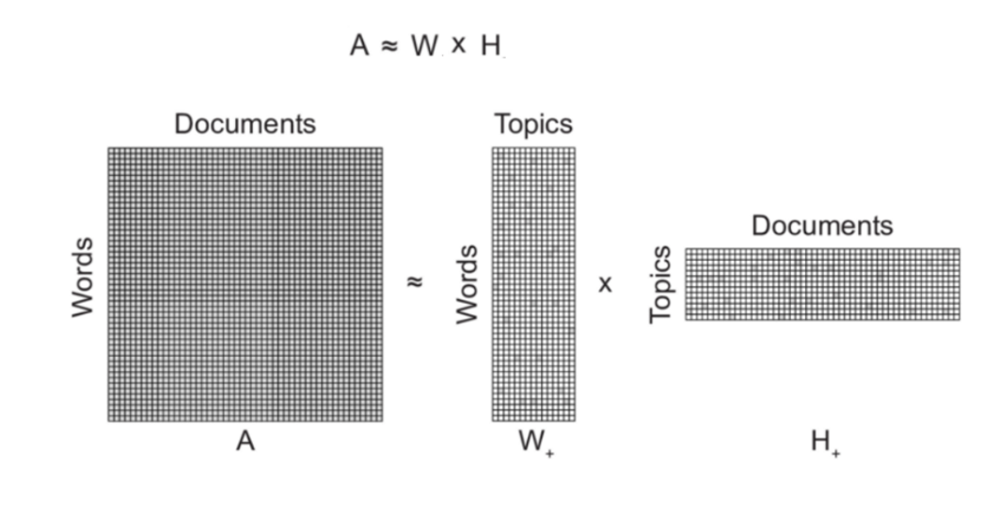
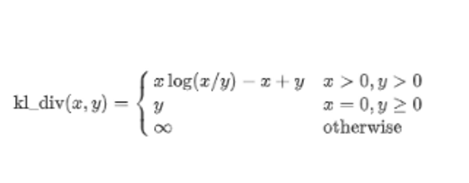
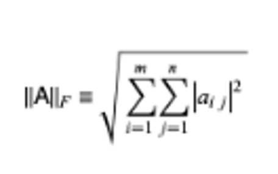

Non-Matrix Factorization
****************************

Introduction
------------------------
------------------------

#. Non-Negative Matrix Factorization (NMF) is an unsupervised topic modelling technique.
#. It belongs to the family of linear algebra algorithms that are used to identify the latent or hidden structure present in the data.
#. NMF decomposes (or factorizes) high-dimensional vectors into a lower-dimensional representation.
#. These lower-dimensional vectors are non-negative which also means their coefficients are non-negative.
#. In case of topic modelling, the input is the term-document matrix, typically TF-IDF normalized:

	* Input: Term-Document matrix, number of topics
	* Output: Gives two non-negative matrices of the original n-words by k topics and those same k topics by the m original documents

#. NMF has become so popular because of its ability to automatically extract sparse and easily interpretable factors.

As shown above, we have the document-term matrix A (Individual documents along the rows of the matrix and each unique term along the columns) which we decompose it into two the following two matrices:

	* First matrix: It has every topic and what terms in it. Each column of this matrix W represents the weightage each word gets in a sentence with respect to a particular topic.
	* Second matrix: It has every document and what topics in it.

NMF will modify the initial values of W and H so that the product approaches A until either the approximation error converges or the max iterations are reached. Therefore, by using NMF we are able to obtain factorized matrices having significantly lower dimensions than those of the product matrix. Intuitively, NMF assumes that the original input is made of a set of hidden features.

**Assumption**: All the elements of the matrices W and H are positive given that all the entries of A are positive.

Algorithm Explained
------------------------
------------------------

The main core of unsupervised learning techniques such as NMF is the quantification of distance between the elements. The distance can be measured by various methods. Two of the generally used methods are:

1) **Generalized Kullback–Leibler divergence**
	
	It is a statistical measure which is used to quantify how one distribution is different from another. Closer the value of Kullback–Leibler divergence to zero, the closeness of the corresponding words increases. In other words, the divergence value is less.

	Formula for calculating the divergence is given by:

2) **Frobenius Norm**
	
	The other method of performing NMF is by using Frobenius norm. It is defined by the square root of sum of absolute squares of its elements. It is also known as eucledian norm. The formula is given below:

An optimization process is mandatory to improve the model and achieve high accuracy in finding relation between the topics.

Performance Optimization
------------------------
------------------------

To improve the model and achieve high accuracy, there are two types of optimization algorithms that we can implement:

	#. Coordinate Descent Solver
	#. Multiplicative Update Solver

	In this technique, we can calculate matrices W and H by optimizing over an objective function (like the EM algorithm), and updates both the matrices W and H iteratively until convergence. We try to measure the error of reconstruction between the matrix A and the product of its factors W and H, on the basis of Euclidean distance.

.. image:: files/pics/MNF_perf_opt.png

Here we parallelly update the values and using the new matrices that we get after updation W and H, we again compute the reconstruction error and repeat this process until we converge.

Model Execution
------------------------
------------------------

Model Evaluation
------------------------
------------------------

Conclusion
------------------------
------------------------

* NMF by default produces sparse representations. This mean that most of the entries are close to zero and only very few parameters have significant values. This can be used when we strictly require fewer topics.

* NMF produces more coherent topics compared to LDA.
