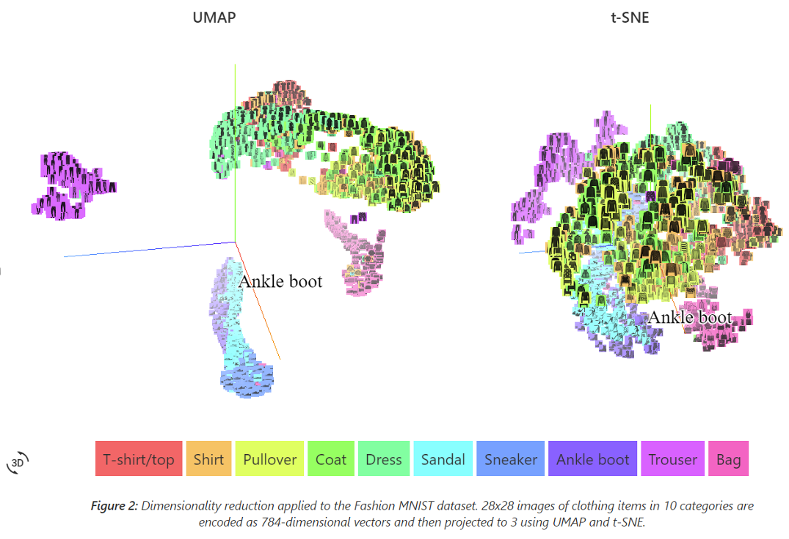
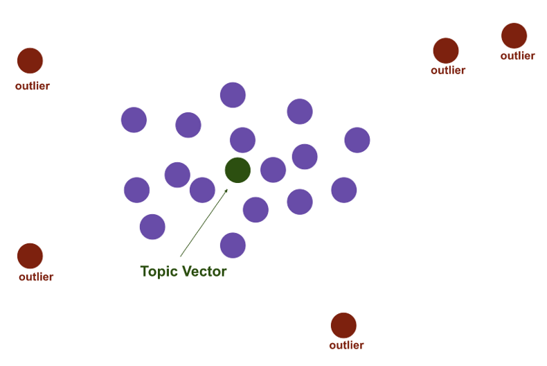

Top2Vec
****************************

Introduction
------------------------
------------------------

Top2Vec model is an easy to implement state-of-the art model used for unsupervised machine learning that automatically detects topics present in text and generates jointly embedded topic, document and word vectors. The number of dense areas of documents found in the semantic space is assumed to be the number of prominent topics. The topic vectors are calculated as the centroids of each dense area of document vectors.

Important usage of Top2Vec is as follows:

	* Obtaining the number of detected documents 
	* Get content and size of the topics
	* Finding the hierarchy in topics
	* Using keywords to search topics
	* Using topics to search document
	* Using keywords to search documents 
	* Finding similar words
	* Finding the same documents

Algorithm Explained
------------------------
------------------------

Following are the steps in this modelling technique:

	* Word and Vector embedding
	* UMAP Dimensionality Reduction
	* HDBSCAN Clustering
	* Centroid calculation and topic assignment

Word and Vector embedding
____________________________

This step includes the generation of embedding vectors that allows us to represent the text document in the mathematical framework. This framework can be multi-dimensional where the dimension depends on the word or text document. This can be performed using `Doc2Vec`_ or `Universal Sentence Encoder`_ or `BERT Sentence Transformer`_.

.. _BERT Sentence Transformer: https://medium.com/@janhavil1202/understanding-topic-modeling-with-top2vec-cdf58bcd6c09
.. _Doc2Vec: https://medium.com/wisio/a-gentle-introduction-to-doc2vec-db3e8c0cce5e
.. _Universal Sentence Encoder: https://tfhub.dev/google/collections/universal-sentence-encoder/1

This follows the simple concept of placing semantically similar words together in the embedding space and dissimilar words further from each other. Words that represent the best should be present nearest to the dense cloud.

Dimensionality Reduction with UMAP
____________________________________

+ Top2vec uses the concepts of UMAP for dimensionality reduction
+ Flexible non-linear dimension reduction algorithm
+ Learns the manifold structure of the data and find a low dimensional embedding that preserves the essential topological structure of that manifold

HDBSCAN Clustering
____________________________________

HDBSCAN is used to find the dense areas of document vectors, as it was designed to handle both noise and variable density clusters. It solves the issue of sparse density. HDBSCAN assigns a label to each dense cluster of document vectors and assigns a noise label to all document vectors that are not in a dense cluster which makes it more effective.

Centroid Calculation and Topic Assignment
___________________________________________

Once we have clusters for each document, we can simply treat each cluster of documents as a separate topic in the topic model. Each topic can be represented as a topic vector that is essentially just the centroid (average point) of the original documents belonging to that topic cluster. 

In order to label the topic using a set of keywords, we can compute the n-closest words to the topic centroid vector.

Model Execution
------------------------
------------------------

Test123

Model Evaluation
------------------------
------------------------

Conclusion
------------------------
------------------------

While Top2Vec is much more complex than the standard LDA approach to topic modeling, it may be able to give us better results since the embedding vectors for words and documents can effectively capture the meaning of words and phrases.
